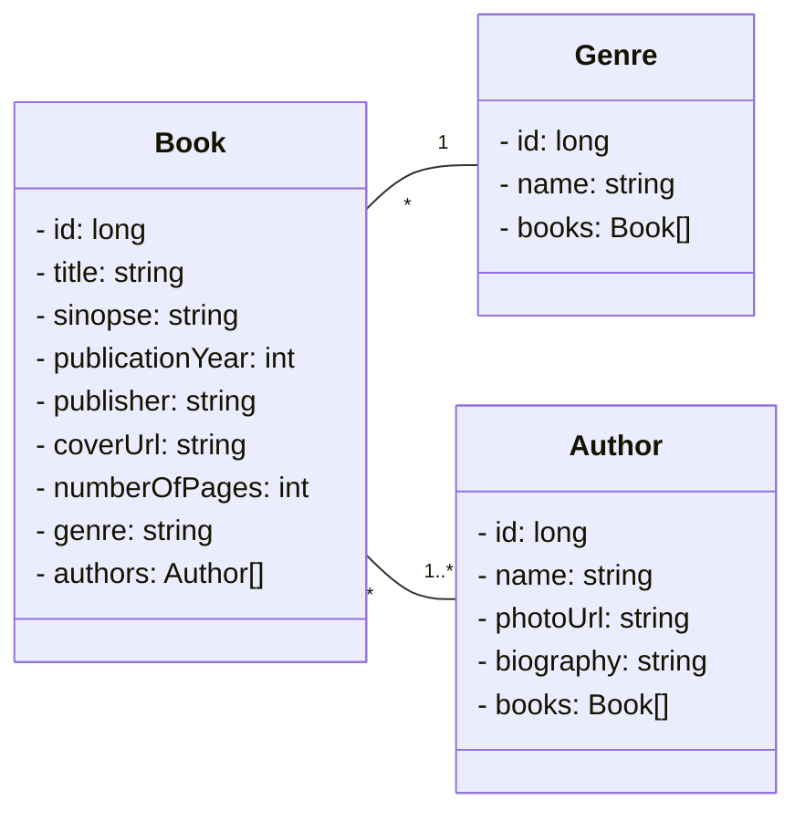

  
  
  

  <a href="#-about-the-project">About</a> |
  <a href="#-technologies">Technologies</a> | 
  <a href="#-how-to">How to</a> | 
  <a href="#-author">Author</a> 

## 💻 About the project

Project developed through UML modeling with Mermaid and Java code implementation with Spring Boot Structure as a challenge for Santander Bootcamp 2023 - Fullstack Java+Angular at [Digital Innovation One](https://www.dio.me/). 
RESTful API to Registration of books and authors.

### Class Diagram

---

## 🛠 Technologies

Technologies and tools that were used in the development of the project:

### **Languages | Environments | Frameworks | Libraries | Techniques**

- Java
- Spring Boot 3
- Spring Data JPA
- Spring Web
- H2 Database
- PostgreSQL
- OpenAPI (Swagger)

### **Utilities**

- Editor: **[IntelliJ IDEA Community Edition](https://www.jetbrains.com/idea/)** | **[JSON Editor Online](https://jsoneditoronline.org/)**
- Generative AI: **[ChatGPT](https://chat.openai.com/)**
- Emojis: **[Emoji Cheat Sheet](https://github.com/ikatyang/emoji-cheat-sheet)**, **[Markdown Emoji](https://gist.github.com/rxaviers/7360908)**
- Shields: **[Shields](https://shields.io/)**

---

## 🔧 How to

### Requirements
- Java 17

### Installation
1. clone repo
2. open project from file system
3. run app `Application.java`
4. navigate to `http://localhost:8080/swagger-ui.html`

---

## 👨‍💻 Author

<table>
  <tr>
    <td align="center">
      <a href="https://jonasmzsouza.github.io/">
         
          
         <b>Jonas Souza</b>
      </a>
    </td>
  </tr>
</table>
 
 
